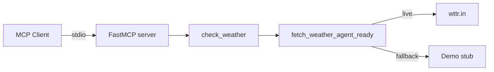
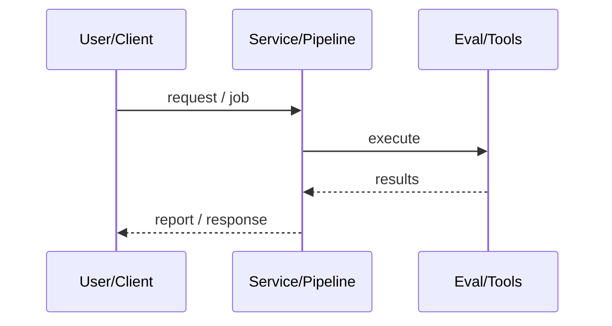
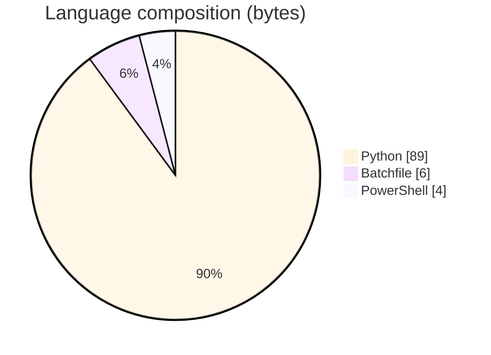

# Python MCP Weather Server

### FastMCP stdio server exposing a resilient `check_weather` tool over wttr.in with demo fallback and observation metadata.

[](https://github.com/ArchanaChetan07/Python-MCP-Weather-Server)
[](https://github.com/ArchanaChetan07/Python-MCP-Weather-Server)
[](https://github.com/ArchanaChetan07/Python-MCP-Weather-Server)
[](https://github.com/ArchanaChetan07/Python-MCP-Weather-Server/actions)

---

## Overview

LLM agents need a small, typed weather tool over MCP that degrades gracefully offline and returns structured success/error observations.

mcp.server.fastmcp FastMCP app; async `check_weather` validates location, fetches wttr.in with timeout, retries alternate spelling, optionally returns demo stub; pytest coverage around the server.

13-file MCP server package with env-configurable timeout/base URL/demo mode, CI workflow, and agent-ready JSON payloads including observation scores.

This repository is maintained as **production-minded portfolio work**: clear architecture, automated checks where present, and metrics that are **traceable to committed artifacts** (never invented).

---

## Architecture

MCP client (stdio) → FastMCP check_weather → tools/weather.fetch_weather_agent_ready → wttr.in or demo stub → JSON observation





---

## Results & repository facts

> Only values found in code, configs, tests, or generated reports are listed. Absence of a clinical/ML accuracy number means it was **not** published in-repo.

| Metric | Value | Source |
|---|---|---|
| Default weather HTTP timeout | **10 seconds** | `config.py` |
| Tracked blobs on main | **13** | `git tree main` |
| Tracked files | **13** | `git tree` |
| Python modules | **5** | `git tree` |
| Test-related paths | **1** | `git tree` |
| CI workflows | **Yes** | `.github/workflows` |
| Docker present | **No** | `repo root` |



---

## Key features

- Single MCP tool: check_weather
- Configurable WEATHER_TIMEOUT_SECONDS (default 10, max 60)
- DEMO_MODE and ALLOW_DEMO_FALLBACK stubs
- Retry with alternate location spelling
- Structured observation + attempts metadata
- pytest suite + GitHub Actions CI

---

## Tech stack

| Layer | Technology |
|---|---|
| language | Python |
| protocol | Model Context Protocol (stdio) |
| library | mcp[cli] FastMCP |
| api | wttr.in |
| packaging | pyproject.toml / uv.lock |

---

## Skills demonstrated

Python · MCP FastMCP · pytest · uv · CI/CD · testing · automation

Keyword surface: **Python · Python · machine-learning · CI/CD · testing · API · Docker · automation · data-science · software-engineering · system-design · observability · LLM · cloud**

---

## Project structure

```text
Python-MCP-Weather-Server/
├── main.py
├── config.py
├── tools/weather.py
├── tests/test_weather_server.py
├── pyproject.toml
└── .github/workflows/ci.yml
```

---

## Installation & usage

```bash
git clone https://github.com/ArchanaChetan07/Python-MCP-Weather-Server.git
cd Python-MCP-Weather-Server
pip install -r requirements.txt
python main.py
```

---

## How it works

On stdio transport, clients invoke `check_weather(location)`; the tool validates input, calls wttr.in within the configured timeout, can retry, and returns a dict with summary/raw/success/demo/error/observation fields suitable for agent loops.

---

## Future improvements

- Add more MCP tools (forecast, alerts)
- OpenAPI-style schema docs for tool outputs
- Replace template README with MCP client wiring examples

---

## License

See repository.

---

<p align="center">
  <b>Python MCP Weather Server</b><br/>
  <a href="https://github.com/ArchanaChetan07/Python-MCP-Weather-Server">github.com/ArchanaChetan07/Python-MCP-Weather-Server</a>
</p>
